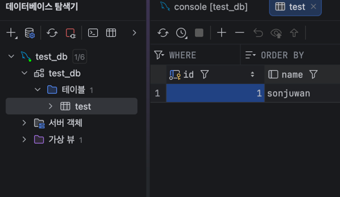
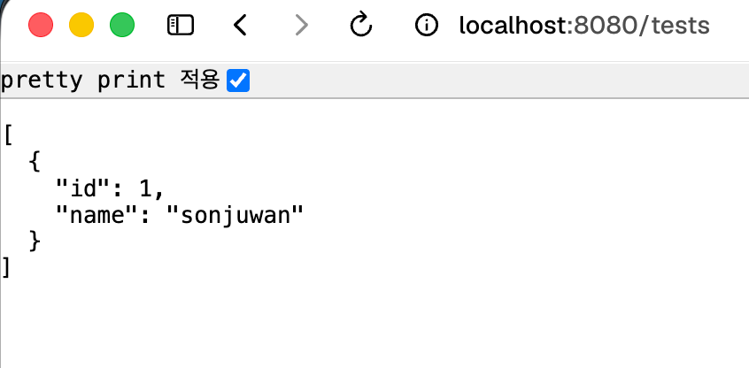
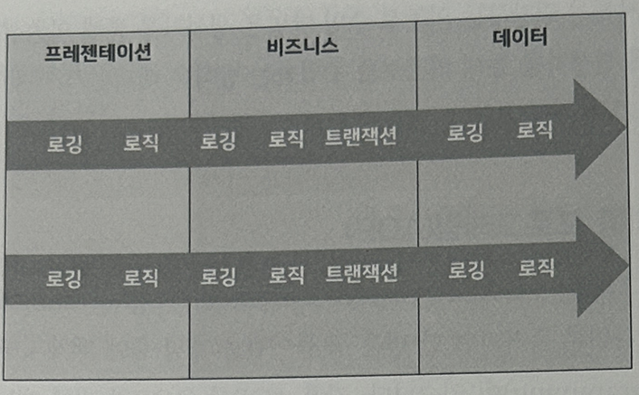
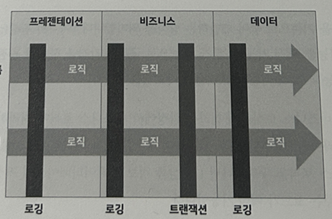
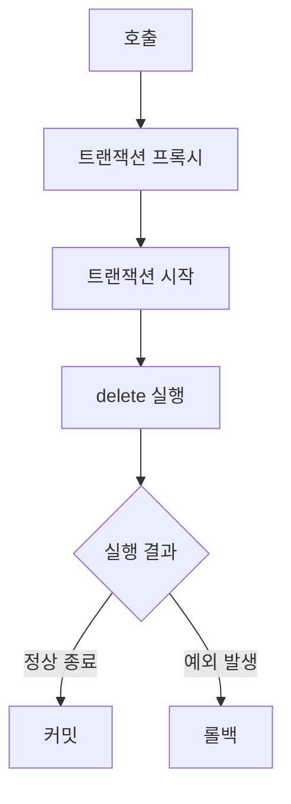
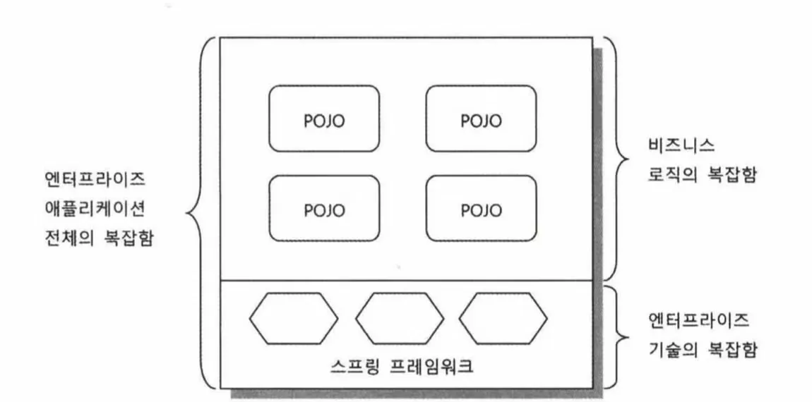
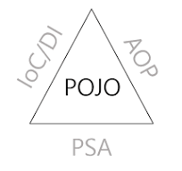
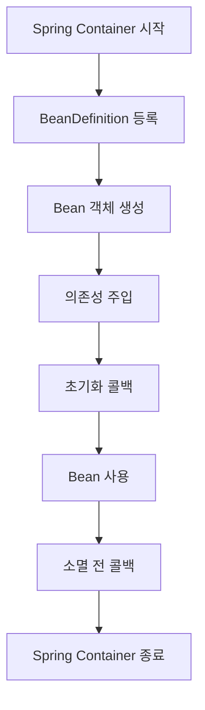
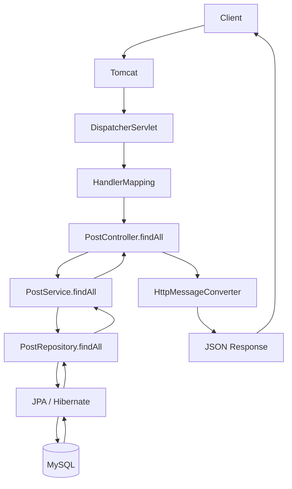

# spring-tutorial-24th
CEOS 백엔드 24기 스프링 튜토리얼


## spring-tutorial-24th를 완료해요!





## Spring이 지원하는 기술들을 조사해요

> 이 README의 모든 개념과 예시는 (댓글 기능이 있는) 게시판을 기준으로 설명합니다!
> Spring을 사용하지 않은 순수 Java 게시판과 Spring Boot 게시판을 비교하며,
> 두 방식의 차이를 통해 Spring의 동작 원리를 이해하는 것을 목표로 합니다.😺

### 1. IoC / DI

#### IoC란?

IoC(Inversion of Control)는 객체를 생성하고 관리하는 제어권이
개발자에서 Spring Container로 넘어가는 것을 의미한다.

순수 Java로 게시판을 구현했다면 개발자가 직접 객체를 생성하고
객체 사이의 의존 관계를 연결해야 한다.

```java
PostRepository postRepository = new MemoryPostRepository();
PostService postService = new PostService(postRepository);
```

하지만 Spring Boot로 게시판을 구현하면 객체의 생성과 조립을 Spring이 대신한다.
Spring Boot 게시판의 `PostService`는 `PostRepository`와 `CommentRepository`를 필요로 하지만,
직접 객체를 생성하지 않는다.

```java
@Service
public class PostService {
    private final PostRepository postRepository;
    private final CommentRepository commentRepository;

    public PostService(
            PostRepository postRepository,
            CommentRepository commentRepository
    ) {
        this.postRepository = postRepository;
        this.commentRepository = commentRepository;
    }
}
```

`SpringApplication.run()`이 실행되면 Spring Boot 애플리케이션이 시작된다.

이때 `@SpringBootApplication`에 포함된 `@ComponentScan`을 통해
애플리케이션 클래스가 위치한 패키지와 하위 패키지를 탐색한다.

Spring은 그 과정에서 `@Service`, `@RestController` 등이 붙은 클래스를 찾아
Spring Container에서 Bean으로 등록하고 관리한다.

또한 `PostService`의 생성자에 필요한 `PostRepository`와
`CommentRepository`를 찾아 연결해준다.

즉, 순수 Java 게시판에서는 개발자가 직접 객체를 생성하고 조립했다면,
Spring Boot 게시판에서는 Spring이 객체의 생성과 조립을 대신한다.
이처럼 객체를 관리하는 제어권이 개발자에서 Spring으로 넘어가는 것을
제어의 역전(IoC)이라고 한다.

다만 모든 객체를 Spring이 생성하는 것은 아니다.
`PostService`와 같은 애플리케이션 구성 요소는 Spring Bean으로 관리하지만,
`PostService` 내부에서 생성하는 `Post` 객체는 게시글 데이터를 표현하는 일반 객체이므로
필요한 시점에 직접 생성한다.

#### DI란?

DI(Dependency Injection)는 객체가 필요로 하는 의존 객체를
직접 생성하지 않고 외부에서 주입받는 것을 의미한다.

게시판에서 `PostService`는 게시글을 저장하고 조회하기 위해
`PostRepository`에 의존한다.

순수 Java 게시판에서는 개발자가 직접 Repository를 생성한 뒤
Service의 생성자에 전달한다.

```java
PostRepository postRepository = new MemoryPostRepository();
PostService postService = new PostService(postRepository);
```

이 코드에서 `PostService`가 동작하기 위해 필요한
`PostRepository`를 생성자를 통해 전달하고 있다.
이것이 의존성 주입이다.

Spring Boot 게시판에서는 Spring Container가
`PostRepository` 객체를 준비한 뒤 `PostService`의 생성자에 주입한다.

```java
@Service
public class PostService {
    private final PostRepository postRepository;

    public PostService(PostRepository postRepository) {
        this.postRepository = postRepository;
    }
}
```

`PostService`는 `PostRepository`의 구현체를 직접 생성하지 않고,
필요하다는 사실만 생성자를 통해 선언한다.
실제 객체를 만들고 연결하는 역할은 Spring이 담당한다.

이 프로젝트에서는 `CommentService`에도 DI가 적용되어 있다.

```java
public CommentService(
        CommentRepository commentRepository,
        PostService postService
) {
    this.commentRepository = commentRepository;
    this.postService = postService;
}
```

생성자 주입을 사용하면 의존성이 명확하게 드러나고,
필요한 의존성이 없을 때 객체가 생성되지 않기 때문에
객체를 안정적으로 만들 수 있다.
또한 의존성을 외부에서 전달받으므로 테스트할 때
가짜 Repository를 주입하기도 쉽다.

IoC가 객체의 생성과 관리에 대한 제어권이
Spring으로 넘어가는 개념이라면,
DI는 Spring이 객체 사이의 의존 관계를 연결하는 구체적인 방법이다.

순수 Java 게시판에서는 개발자가 의존 객체를 직접 만들고 주입하지만,
Spring Boot 게시판에서는 Spring이 의존 객체를 만들고 주입한다.

### 2. AOP

#### AOP란?

AOP(Aspect-Oriented Programming)는 여러 기능에서 반복적으로 필요한
공통 관심사를 핵심 비즈니스 로직과 분리하는 프로그래밍 방식이다.



게시판을 구현하다 보면 트랜잭션 관리, 로깅, 권한 확인,
예외 처리와 같은 기능이 여러 메서드에서 반복될 수 있다.
이러한 기능을 각각의 비즈니스 로직 안에 직접 작성하면
코드가 복잡해지고 중복이 발생한다.



AOP는 공통 기능을 별도의 모듈로 분리한 뒤,
필요한 메서드의 실행 전후에 자동으로 적용한다.

#### Spring AOP는 어떻게 동작할까?

Spring AOP는 공통 기능을 별도의 모듈로 분리한 뒤,
프록시를 통해 필요한 메서드의 실행 전후에 적용한다.

#### 순수 Java 게시판에서의 공통 기능 처리

순수 Java로 게시판을 구현한다면 개발자가 직접
트랜잭션을 시작하고 커밋하거나 예외 발생 시 롤백해야 한다.

```java
try {
    transaction.begin();

    // 게시글 삭제
    postRepository.deleteById(id);

    transaction.commit();
} catch (Exception e) {
    transaction.rollback();
    throw e;
}
```

이런 코드가 여러 기능에 반복되면 비즈니스 로직과
트랜잭션 처리 코드가 섞이게 된다.

#### Spring Boot 게시판에서의 AOP

Spring Boot에서는 `@Transactional`을 사용하여
트랜잭션 처리를 비즈니스 로직과 분리할 수 있다.

```java
@Transactional
public void delete(Long id) {
    findById(id);
    commentRepository.deleteByPostId(id);
    postRepository.deleteById(id);
}
```

개발자는 게시글과 댓글을 삭제하는 핵심 로직만 작성하고,
트랜잭션을 시작하고 종료하는 작업은 Spring이 처리한다.

#### `@Transactional`의 동작 과정

Spring은 `@Transactional`이 붙은 메서드를 실행할 때
해당 객체를 그대로 사용하는 것이 아니라 프록시 객체를 통해 호출한다.



프록시 객체가 메서드 호출을 가로채서
메서드 실행 전 트랜잭션을 시작하고,
정상적으로 끝나면 커밋하며,
예외가 발생하면 롤백한다.

#### 게시판에서 AOP를 적용한 이유

게시글을 삭제할 때 게시글에 달린 댓글도 함께 삭제해야 한다.

```java
@Transactional
public void delete(Long id) {
    findById(id);
    commentRepository.deleteByPostId(id);
    postRepository.deleteById(id);
}
```

두 삭제 작업 중 하나라도 실패하면 전체 작업이 취소되어야 한다.
그렇지 않으면 댓글만 삭제되고 게시글은 남거나,
게시글은 삭제됐는데 댓글이 남는 문제가 발생할 수 있다.

따라서 두 작업을 하나의 트랜잭션으로 묶기 위해
`@Transactional`을 사용했다.

#### AOP를 사용하며 알게 된 점

AOP는 비즈니스 로직 자체를 작성하는 기술이라기보다,
여러 곳에서 공통으로 필요한 기능을 분리하여
핵심 로직에 자동으로 적용하는 기술이다.

Spring AOP는 프록시 기반으로 동작하기 때문에
같은 클래스 내부에서 `this.method()` 형식으로 호출하면
프록시를 거치지 않아 AOP가 적용되지 않을 수 있다.

#### 참고 자료

- [Spring AOP 공식 문서](https://docs.spring.io/spring-framework/reference/core/aop.html)
- [Spring Proxying 공식 문서](https://docs.spring.io/spring-framework/reference/core/aop/proxying.html)

### 3. PSA

#### PSA란?

PSA(Portable Service Abstraction)는 특정 기술이나 구현 방법에
직접 의존하지 않도록 공통 기능을 추상화한 인터페이스를 제공하는 방식이다.

개발자는 실제 내부에서 어떤 기술이 사용되는지 모두 알지 않아도
Spring이 제공하는 추상화된 인터페이스를 사용할 수 있다.

따라서 내부 구현 기술이 변경되더라도
애플리케이션의 핵심 코드를 크게 수정하지 않아도 된다.

#### 순수 Java 게시판에서의 데이터베이스 접근

순수 Java로 게시판을 구현한다면 JDBC를 직접 사용하여
Connection을 생성하고 SQL을 실행해야 한다.

```java
Connection connection = dataSource.getConnection();

PreparedStatement statement =
        connection.prepareStatement("SELECT * FROM post");

ResultSet resultSet = statement.executeQuery();
```

이 방식에서는 데이터베이스 연결, SQL 작성,
결과 변환, 예외 처리 등을 개발자가 직접 구현해야 한다.

#### Spring Boot 게시판에서의 데이터베이스 접근

Spring Boot 게시판에서는 `JpaRepository`를 사용하여
데이터베이스 접근 기술을 추상화할 수 있다.

```java
public interface PostRepository extends JpaRepository<Post, Long> {
}
```

`PostRepository`는 직접 SQL을 작성하거나 JDBC Connection을
관리하지 않지만 `findAll()`, `findById()`, `save()`,
`deleteById()`와 같은 기능을 사용할 수 있다.

내부적으로는 JPA와 Hibernate가 데이터베이스와 통신하지만,
Service는 구체적인 구현 기술이 아니라
`PostRepository`라는 추상화에 의존한다.

#### Spring MVC에서의 PSA

Spring MVC의 `@GetMapping`, `@PostMapping`도 PSA의 예시로 볼 수 있다.

```java
@GetMapping
public List<PostResponse> findAll() {
    return postService.findAll()
            .stream()
            .map(PostResponse::from)
            .toList();
}
```

Servlet을 직접 구현한다면 HTTP 메서드와 URL을 확인하고
직접 요청과 응답을 처리해야 한다.

하지만 Spring MVC에서는 `@GetMapping`을 사용하여
특정 GET 요청을 메서드와 연결할 수 있다.
Spring이 내부적으로 Servlet API와 요청 처리 과정을 담당하기 때문에
개발자는 Controller의 기능에 집중할 수 있다.

#### 게시판에서 PSA를 사용했을 때의 장점

게시판의 Service는 Hibernate나 JDBC의 구체적인 사용 방법을 알 필요가 없다.
`PostRepository`와 같은 추상화된 인터페이스만 사용하면 된다.

이로 인해:

- 구현 기술에 대한 의존도가 낮아진다.
- 코드가 단순해진다.
- 테스트하기 쉬워진다.
- 내부 구현 기술을 변경하기 쉬워진다.

#### PSA에 대해 이해한 점

PSA는 기술을 완전히 숨기는 것이 아니라,
개발자가 자주 사용하는 기능을 일관된 인터페이스로 사용할 수 있도록
Spring이 복잡한 구현을 감싸주는 방식이다.

따라서 개발자는 JDBC, Hibernate, Servlet의 세부 동작을
매번 직접 다루지 않고도 게시판 기능을 구현할 수 있다.

### 4. POJO

#### POJO란?



POJO(Plain Old Java Object)는 특정 프레임워크나 기술에 종속되지 않은
일반적인 Java 객체를 의미한다.

특정 클래스를 반드시 상속하거나 특정 인터페이스를 구현해야만
사용할 수 있는 객체가 아니라, Java의 클래스와 필드,
생성자, 메서드만으로 구성된 객체이다.



스프링은 pojo를 유지하면서도 엔터프라이즈 기능을 제공할 수 있는 이유는
ioC/DI, AOP, PSA라는 세가지 핵심 기술 덕분이다.

게시판의 게시글을 표현하는 객체를 순수 Java로 작성하면
다음과 같은 형태가 될 수 있다.

```java
public class Post {
    private Long id;
    private String title;
    private String content;
    private String author;

    public Post(Long id, String title, String content, String author) {
        this.id = id;
        this.title = title;
        this.content = content;
        this.author = author;
    }
}
```

이 클래스는 Spring의 특정 클래스를 상속하거나
Spring에서만 동작하는 메서드를 구현하지 않는다.
따라서 Spring을 사용하지 않는 순수 Java 게시판에서도 사용할 수 있다.

#### Spring에서 POJO를 사용하는 이유

Spring은 개발자가 비즈니스 로직을 순수한 Java 객체로 작성할 수 있도록 한다.
Spring의 기능이 필요하더라도 반드시 Spring의 부모 클래스를 상속하거나
프레임워크 전용 인터페이스를 구현할 필요는 없다.

Spring Boot 게시판의 Service도 일반 Java 클래스로 작성한 뒤
`@Service` 어노테이션을 통해 Spring이 관리하도록 만들 수 있다.

```java
@Service
public class PostService {
    private final PostRepository postRepository;

    public PostService(PostRepository postRepository) {
        this.postRepository = postRepository;
    }
}
```

`PostService`는 `@Service`를 통해 Spring Bean으로 등록되지만,
Spring의 특정 클래스를 상속하지 않는다.
객체의 핵심 코드는 일반 Java 방식으로 작성하고,
Spring은 필요한 객체 관리와 부가 기능을 외부에서 제공한다.

이러한 구조는 프레임워크와 비즈니스 로직의 결합도를 낮춰준다.
따라서 코드를 테스트하기 쉽고, 다른 환경이나 기술로 변경할 때도
수정해야 하는 범위를 줄일 수 있다.

## Spring Bean을 조사해요

### 1. Spring Bean이란?

Spring Bean은 Spring Container가 생성하고 관리하는 객체를 의미한다.

순수 Java 게시판에서는 개발자가 직접 객체를 생성한다.

```java
PostRepository postRepository = new MemoryPostRepository();
PostService postService = new PostService(postRepository);
```

이때 개발자가 `new` 키워드로 만든 객체는 일반적인 Java 객체이며,
Spring Container가 관리하지 않기 때문에 Spring Bean이 아니다.

Spring Boot 게시판에서는 `@Service`, `@RestController`,
`@Repository`와 같은 어노테이션이 붙은 클래스를 Spring이 발견하고
객체를 생성하여 Container에 등록한다.

```java
@Service
public class PostService {
    private final PostRepository postRepository;

    public PostService(PostRepository postRepository) {
        this.postRepository = postRepository;
    }
}
```

위 코드에서 `PostService` 객체는 Spring이 생성하고 관리하므로
Spring Bean이다.

또한 `PostController`에는 `@RestController`가 붙어 있기 때문에
Spring Bean으로 등록되며, `PostService`를 주입받을 수 있다.

```java
@RestController
@RequestMapping("/posts")
public class PostController {
    private final PostService postService;

    public PostController(PostService postService) {
        this.postService = postService;
    }
}
```

`PostRepository`는 개발자가 직접 구현 클래스를 작성하지 않았지만,
Spring Data JPA가 인터페이스를 바탕으로 구현 객체를 만들어
Spring Bean으로 등록한다.

```java
public interface PostRepository extends JpaRepository<Post, Long> {
}
```

Spring Bean으로 등록된 객체들은 Spring Container 안에서 관리되며,
다른 객체가 필요로 할 때 의존성 주입을 통해 전달된다.

다만 `Post`와 같은 Entity 객체는 Spring Bean과 다르다.
`@Entity`는 JPA가 데이터베이스 테이블과 객체를 연결하기 위한
어노테이션이며, 해당 객체를 Spring Container가 관리한다는 의미는 아니다.

정리하면 Spring Bean은 단순히 어노테이션이 붙은 모든 객체가 아니라,
Spring Container가 생성하고 의존성을 관리하는 객체이다.

```text
@Service          → Spring Bean
@RestController   → Spring Bean
@Repository       → Spring Bean
@Entity           → JPA가 관리하는 Entity
new Post(...)     → 일반 Java 객체
```

### 2. Bean의 생명주기

Spring Bean의 생명주기는 Spring Container가 Bean을 생성한 뒤
애플리케이션이 종료될 때까지 Bean을 관리하는 과정이다.

게시판 애플리케이션이 실행되면 Spring은 먼저
`@Service`, `@RestController` 등이 붙은 클래스를 탐색하고
Bean으로 등록할 대상의 정보를 준비한다.

이후 다음과 같은 순서로 Bean을 관리한다.

1. BeanDefinition 등록

   Spring이 Bean의 클래스 정보, 이름, Scope, 의존성 등의 정보를
   BeanDefinition이라는 형태로 등록한다.

2. 객체 생성

   BeanDefinition을 바탕으로 실제 객체를 생성한다.

3. 의존성 주입

   생성자에 필요한 다른 Bean을 찾아 주입한다.

   예를 들어 `PostService`를 생성할 때
   `PostRepository`와 `CommentRepository`가 주입된다.

4. 초기화

   의존성 주입이 끝난 뒤 Bean을 사용하기 위한 초기화 작업을 수행한다.
   `@PostConstruct`나 초기화 메서드를 사용할 수 있다.

5. Bean 사용

   애플리케이션이 실행되는 동안 Controller, Service, Repository 등의
   Bean이 요청을 처리한다.

6. 소멸 전 처리

   애플리케이션이 종료되기 전에 `@PreDestroy`나
   소멸 메서드를 통해 연결이나 파일 등의 자원을 정리한다.

7. Spring Container 종료

   Spring Container가 종료되고 관리하던 Bean도 함께 정리된다.

생명주기를 직접 확인할 수 있는 예시는 다음과 같다.

```java
@Component
public class BoardLogger {

    @PostConstruct
    public void init() {
        System.out.println("Bean 초기화");
    }

    @PreDestroy
    public void destroy() {
        System.out.println("Bean 소멸");
    }
}
```

이 Bean을 등록하면 서버가 시작될 때 `init()`이 실행되고,
서버가 종료될 때 `destroy()`가 실행된다.

전체 흐름은 다음과 같다.



게시판 코드에 연결하면 다음과 같이 이해할 수 있다.

```text
PostController 생성
    ↓
PostService 주입
    ↓
PostRepository 주입
    ↓
애플리케이션 실행 중 게시판 요청 처리
    ↓
서버 종료 시 Bean 정리
```

현재 게시판 코드에는 직접 작성한 `@PostConstruct`나 `@PreDestroy`가 없기 때문에,
실제 코드에서 초기화·소멸 콜백을 사용했다기보다는
Spring Bean이 일반적으로 거치는 생명주기를 설명한 예시이다.


### 3. Bean Scope

Bean Scope는 Spring Bean을 몇 개 만들고,
얼마나 오래 유지할지 정하는 규칙이다.

```text
이 Bean을 하나만 만들까?
요청마다 새로 만들까?
사용자마다 따로 만들까?
```

#### Singleton

Singleton은 Spring Bean의 기본 Scope이다.
애플리케이션 전체에서 하나의 Bean 객체만 생성하고,
여러 요청이 같은 객체를 공유한다.

`@Service`, `@RestController`, `@Repository`로 등록된 게시판의
Controller, Service, Repository는 기본적으로 Singleton으로 관리된다.

```text
Post 요청 1 ─┐
Post 요청 2 ─┼─ 같은 PostService 객체 사용
Post 요청 3 ─┘
```

따라서 Singleton Bean의 필드에 요청마다 달라지는 값을 저장하면 안 된다.
여러 요청이 같은 객체를 공유하기 때문에 동시성 문제가 발생할 수 있다.

```java
@Service
public class PostService {
    private Long currentPostId; // 요청별 값 저장은 위험하다.
}
```

요청마다 달라지는 값은 Bean의 필드가 아니라
메서드의 매개변수나 지역 변수로 관리해야 한다.

```java
public Post findById(Long id) {
    return postRepository.findById(id)
            .orElseThrow(() -> new PostNotFoundException(id));
}
```

#### Prototype

Prototype Scope는 Bean을 요청할 때마다 새로운 객체를 생성한다.

```text
요청 1 → 새로운 객체
요청 2 → 새로운 객체
요청 3 → 새로운 객체
```

Spring은 Prototype Bean의 생성과 의존성 주입까지 관리하지만,
생성된 객체의 전체 생명주기를 Singleton처럼 관리하지는 않는다.

#### Request

Request Scope는 HTTP 요청마다 새로운 Bean을 생성한다.
하나의 요청 안에서는 같은 객체를 사용하고,
요청이 끝나면 해당 Bean의 생명주기도 끝난다.

요청별 임시 데이터나 요청 단위의 정보를 저장할 때 사용할 수 있다.

#### Session

Session Scope는 HTTP 세션마다 새로운 Bean을 생성한다.
같은 사용자의 세션에서는 같은 Bean을 사용하고,
사용자의 세션이 종료되면 Bean도 함께 종료된다.

#### 게시판에서 사용하는 Scope

게시판의 `PostController`, `PostService`, `PostRepository`는
특별한 Scope를 지정하지 않았으므로 기본값인 Singleton으로 관리된다.
대신 게시글 ID와 요청 데이터처럼 요청마다 달라지는 값은
메서드의 매개변수로 전달한다.

### 4. 어노테이션이란?

어노테이션은 클래스, 메서드, 필드 등에 붙여서
코드에 추가 정보를 전달하는 문법이다.

주석이 개발자가 읽기 위한 메모라면,
어노테이션은 컴파일러나 프레임워크가 읽고
특정 동작을 수행하도록 알려주는 메타데이터에 가깝다.

Java에서는 `@interface` 키워드를 사용해
사용자 정의 어노테이션을 만들 수 있다.

```java
@Target(ElementType.TYPE)
@Retention(RetentionPolicy.RUNTIME)
public @interface BoardComponent {
    String value() default "";
}
```

`@Target`은 어노테이션을 어디에 붙일 수 있는지 지정하고,
`@Retention`은 어노테이션 정보를 언제까지 유지할지 지정한다.
Spring은 런타임에 어노테이션 정보를 읽어
Bean 등록이나 요청 매핑과 같은 동작을 수행한다.

게시판에서 사용하는 어노테이션의 예시는 다음과 같다.

```java
@Service
public class PostService {
    // Spring이 이 클래스를 Bean으로 등록한다.
}
```

`@Service` 자체가 객체를 직접 생성하는 것은 아니다.
Spring이 애플리케이션을 시작하면서 이 어노테이션을 확인하고,
해당 클래스를 Bean으로 등록하는 데 사용한다.

### 5. 어노테이션을 통한 Bean 등록 과정

클래스에 `@Service`와 같은 어노테이션을 붙인다고 해서
Java의 일반 객체가 자동으로 Spring Bean이 되는 것은 아니다.
애플리케이션이 시작될 때 Spring이 해당 어노테이션을 발견하고
Container에 등록하는 과정을 거친다.

1. 컴포넌트 탐색

   Spring이 지정된 패키지를 탐색하여
   `@Component` 또는 이를 포함하는 `@Service`, `@Repository`,
   `@Controller` 등의 어노테이션이 붙은 클래스를 찾는다.

2. BeanDefinition 생성

   발견한 클래스의 타입, Bean 이름, Scope, 의존성 등의 정보를
   BeanDefinition에 기록한다.

3. Bean 객체 생성 및 등록

   Spring Container가 BeanDefinition을 바탕으로 객체를 생성하고,
   Container에 등록하여 관리한다.

4. 의존성 주입

   객체 생성에 필요한 다른 Bean을 찾아 생성자 등에 주입한다.
   예를 들어 `PostService`를 생성할 때
   `PostRepository`가 주입된다.

5. Bean 사용

   등록된 Bean은 Controller의 요청 처리나
   Service의 비즈니스 로직 수행에 사용된다.

### 6. Component Scan

#### `@ComponentScan`이란?

`@ComponentScan`은 Spring이 Bean으로 등록할 클래스를
찾기 위해 특정 패키지를 탐색하도록 하는 어노테이션이다.

`@Service`, `@Repository`, `@Controller`는
`@Component`를 포함하고 있기 때문에 Component Scan의 대상이 된다.

#### Spring이 Component를 찾는 과정

1. 탐색 범위 설정

   `@ComponentScan`이 지정한 패키지를 기준으로
   해당 패키지와 하위 패키지를 탐색한다.

2. 컴포넌트 탐색

   탐색한 클래스 중 `@Component` 또는
   이를 포함하는 어노테이션이 붙은 클래스를 찾는다.

3. BeanDefinition 생성

   찾은 클래스의 정보와 의존성 정보를 BeanDefinition으로 만든다.

4. Bean 등록

   Spring Container가 BeanDefinition을 바탕으로 객체를 생성하고
   Container에 등록한다.

#### 게시판 예시에서의 Component Scan

`@SpringBootApplication`에는 `@ComponentScan`이 포함되어 있다.
따라서 애플리케이션 클래스가 위치한 패키지를 기준으로
하위 패키지의 Component를 자동으로 탐색한다.

게시판의 패키지 구조가 다음과 같다면:

```text
com.example.board
├── BoardApplication
├── controller
│   └── PostController
├── service
│   └── PostService
└── repository
    └── PostRepository
```

`BoardApplication`이 `com.example.board`에 위치하므로
하위 패키지의 `PostController`, `PostService` 등을 탐색할 수 있다.
찾은 Component들은 Bean으로 등록되고,
생성자에 필요한 의존성이 연결된 뒤 애플리케이션에서 사용된다.

## Spring MVC를 심층 분석해요

### 1. MVC 패턴이란?

MVC(Model-View-Controller)는 애플리케이션의 역할을
Model, View, Controller로 나누어 관리하는 디자인 패턴이다.

각 역할을 분리하면 하나의 클래스가 데이터 관리,
화면 출력, 사용자 요청 처리를 모두 담당하는 것을 막을 수 있다.
게시판을 예시로 들면 다음과 같이 나눌 수 있다.

- Model: 게시글과 댓글 같은 데이터와 비즈니스 상태를 표현한다.
- View: Model의 데이터를 사용자에게 보여주는 화면을 담당한다.
- Controller: 사용자의 요청을 받아 적절한 Model과 View를 연결한다.

일반적인 게시판에서 사용자가 게시글 목록을 요청하면,
Controller가 요청을 받고 Model에서 게시글을 조회한 뒤
View에 전달하여 화면에 보여준다.

### 2. Spring MVC란?

Spring MVC는 MVC 패턴을 웹 애플리케이션에 적용한
Spring Framework의 웹 프레임워크이다.

Spring MVC는 Servlet API를 기반으로 동작하며,
HTTP 요청을 Controller의 메서드와 연결하고
메서드의 반환값을 HTTP 응답으로 변환하는 기능을 제공한다.

Spring Boot 게시판에서는 다음과 같은 Controller를 작성할 수 있다.

```java
@RestController
@RequestMapping("/posts")
public class PostController {

    private final PostService postService;

    public PostController(PostService postService) {
        this.postService = postService;
    }

    @GetMapping
    public List<PostResponse> findAll() {
        return postService.findAll()
                .stream()
                .map(PostResponse::from)
                .toList();
    }
}
```

`@GetMapping`은 GET `/posts` 요청과 `findAll()` 메서드를 연결한다.
Controller는 직접 데이터베이스에 접근하지 않고 Service를 호출하며,
조회 결과를 응답 형식에 맞는 DTO로 변환하여 반환한다.

#### 일반 MVC 패턴과 Spring MVC의 차이

일반적인 MVC 패턴에서는 개발자가 요청을 직접 분석하고,
Controller와 View를 직접 연결하는 코드를 작성해야 한다.

반면 Spring MVC에서는 DispatcherServlet을 중심으로
요청 분배와 응답 처리를 Spring이 담당한다.
개발자는 `@GetMapping`, `@PostMapping`과 같은 어노테이션을 사용해
어떤 요청을 어떤 메서드가 처리할지 선언할 수 있다.

또한 REST API에서는 HTML View 대신 객체를 반환할 수 있다.
Spring MVC가 반환 객체를 JSON으로 변환하여 HTTP 응답 본문에 넣어주므로,
게시판 Controller는 JSON 변환 과정까지 직접 구현하지 않아도 된다.

정리하면 MVC는 애플리케이션의 역할을 나누는 설계 패턴이고,
Spring MVC는 이 패턴을 Servlet 기반 웹 요청 처리 기능과
Spring Container, 메시지 변환 기능으로 구현한 프레임워크이다.

### 3. Servlet이란?

Servlet은 Java로 작성된 웹 컴포넌트로,
웹 클라이언트의 요청을 받아 응답을 생성하는 역할을 한다.

Servlet 자체는 요청을 받을 때마다 새로 만들어지는 것이 아니라,
Servlet Container가 Servlet을 생성하고 생명주기를 관리한다.
일반적인 생명주기는 `init()`, `service()`, `destroy()`의 흐름으로 이루어진다.

웹 요청이 들어오면 Servlet Container는 요청과 응답 객체를 만들고,
해당 Servlet의 `service()` 메서드를 호출한다.
Servlet은 요청의 경로와 HTTP 메서드 등을 확인한 뒤
필요한 작업을 수행하고 응답을 작성한다.

Spring MVC에서는 개발자가 Servlet을 직접 작성하는 대신
Spring이 제공하는 `DispatcherServlet`이 대표 Servlet 역할을 한다.
DispatcherServlet이 요청을 받은 뒤 적절한 Controller를 찾아 호출하므로,
개발자는 각각의 게시판 기능에 집중할 수 있다.

### 4. Tomcat과 WAS

#### Tomcat이란?

Tomcat은 Java 웹 애플리케이션을 실행하기 위한 Servlet Container이다.
HTTP 요청을 받고 Servlet을 실행하며,
Servlet의 생성과 초기화, 요청 처리, 종료까지 관리한다.

Spring Boot 애플리케이션에서는 내장 Tomcat을 사용하기 때문에
Tomcat을 별도로 설치하고 배포하지 않아도 애플리케이션을 실행할 수 있다.

#### WAS란?

WAS(Web Application Server)는 웹 애플리케이션을 실행하고
클라이언트의 요청을 처리하는 서버이다.

정적인 파일을 전달하는 웹 서버의 기능뿐만 아니라,
Servlet 실행, 데이터베이스 연동, 트랜잭션 처리 등
애플리케이션의 동적인 기능도 수행할 수 있다.

#### Tomcat과 WAS의 관계

Tomcat은 Servlet을 실행할 수 있는 Servlet Container이며,
WAS의 역할을 수행할 수 있는 서버 중 하나이다.

Spring Boot 게시판을 실행하면 내장 Tomcat이 시작되고,
Tomcat 안에서 Spring의 `DispatcherServlet`이 실행된다.
따라서 요청의 전체 흐름은 다음과 같다.

```text
클라이언트
    ↓
내장 Tomcat
    ↓
DispatcherServlet
    ↓
Spring MVC Controller
```

### 5. DispatcherServlet

#### DispatcherServlet이란?

DispatcherServlet은 Spring MVC의 Front Controller이다.

Front Controller는 여러 요청을 각각의 Servlet이 처리하는 대신,
하나의 중앙 Servlet이 모든 요청을 먼저 받은 뒤
적절한 처리자에게 요청을 전달하는 구조이다.

Spring MVC의 DispatcherServlet은 요청을 받은 뒤
HandlerMapping을 사용하여 요청을 처리할 Controller를 찾고,
HandlerAdapter를 통해 해당 Controller의 메서드를 실행한다.
이후 Controller의 반환값을 View 또는 HTTP 응답으로 변환한다.

#### DispatcherServlet의 동작 흐름

게시판의 `GET /posts` 요청을 예시로 들면 다음과 같이 동작한다.

1. Tomcat이 HTTP 요청을 받는다.
2. Tomcat이 DispatcherServlet에 요청을 전달한다.
3. DispatcherServlet이 HandlerMapping을 통해
   `GET /posts`를 처리할 Controller 메서드를 찾는다.
4. HandlerAdapter가 `PostController.findAll()`을 호출한다.
5. Controller가 PostService를 호출한다.
6. Service가 PostRepository를 통해 게시글을 조회한다.
7. 조회 결과가 Controller로 반환된다.
8. Spring MVC가 반환 객체를 JSON으로 변환한다.
9. DispatcherServlet을 거쳐 클라이언트에 HTTP 응답을 반환한다.

#### `doDispatch` 메서드 분석

DispatcherServlet의 `doDispatch()`는 실제 요청 처리의 중심이 되는 메서드이다.
요청에 맞는 Handler를 찾고, HandlerAdapter를 통해 실행한 뒤,
실행 결과를 응답으로 처리하는 흐름이 이 메서드 안에서 이루어진다.

전체 코드는 복잡하지만 게시판의 `GET /posts` 요청과 연결하면
다음과 같은 순서로 이해할 수 있다.

```text
doDispatch(request, response)
    ↓
HandlerMapping으로 요청에 맞는 Handler 탐색
    ↓
HandlerAdapter 선택
    ↓
Interceptor의 preHandle 실행
    ↓
Controller 메서드 실행
    ↓
Interceptor의 postHandle 실행
    ↓
반환값을 JSON 응답으로 변환
    ↓
Interceptor의 afterCompletion 실행
```

Spring MVC 내부의 흐름을 단순화하면 다음과 같이 표현할 수 있다.

```java
protected void doDispatch(HttpServletRequest request,
                          HttpServletResponse response) {
    HandlerExecutionChain handler = getHandler(request);
    HandlerAdapter adapter = getHandlerAdapter(handler.getHandler());

    if (!handler.applyPreHandle(request, response)) {
        return;
    }

    ModelAndView result = adapter.handle(request, response, handler.getHandler());
    handler.applyPostHandle(request, response, result);
    processDispatchResult(request, response, handler, result);
}
```

REST Controller가 객체를 반환하는 경우에는 실제로 View를 렌더링하기보다
HttpMessageConverter가 반환 객체를 JSON으로 변환하여 응답 본문에 작성한다.
따라서 `PostController.findAll()`이 반환한 `List<PostResponse>`는
JSON 배열 형태로 클라이언트에 전달된다.

### 6. 게시판의 요청 처리 흐름

`GET /posts` 요청 기준



1. Client가 `GET /posts` 요청을 보낸다.
2. Tomcat이 요청을 받아 DispatcherServlet로 전달한다.
3. DispatcherServlet은 HandlerMapping을 통해
   `PostController.findAll()`을 찾는다.
4. Controller는 PostService에 게시글 전체 조회를 요청한다.
5. PostService는 PostRepository의 `findAll()`을 호출한다.
6. Spring Data JPA와 Hibernate가 데이터베이스에서 게시글을 조회한다.
7. 조회된 결과가 Controller까지 돌아온다.
8. Controller가 반환한 게시글 목록을 HttpMessageConverter가 JSON으로 변환한다.
9. JSON 응답이 Tomcat을 거쳐 Client에게 전달된다.

이 구조에서 각 계층은 역할이 분리되어 있다.
Controller는 HTTP 요청과 응답을 담당하고,
Service는 게시판의 비즈니스 로직을 담당하며,
Repository는 데이터베이스 접근을 담당한다.

#### 참고 자료

- [Spring Web MVC 공식 문서](https://docs.spring.io/spring/reference/web/webmvc.html)
- [DispatcherServlet 공식 문서](https://docs.spring.io/spring-framework/reference/web/webmvc/mvc-servlet.html)
- [DispatcherServlet 처리 과정 공식 문서](https://docs.spring.io/spring-framework/reference/web/webmvc/mvc-servlet/sequence.html)
- [Apache Tomcat 공식 문서](https://tomcat.apache.org/tomcat-11.0-doc/)
